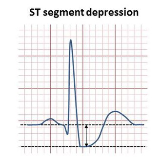
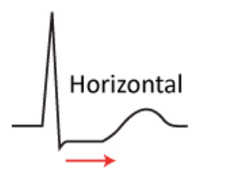
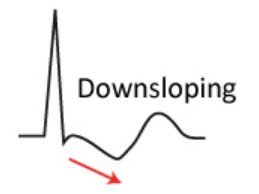
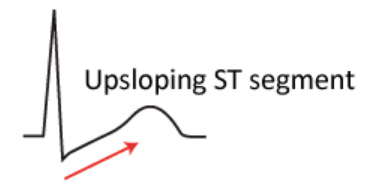

# Heart attack analysis

This is a data mining project for the data mining course of the Data Science University of Florence.

We will use the Heart attack dataset named [heart.csv](Data/heart.csv)  to predict an heart attack.

It's suggested to run the Jupyter notebook in a virtual environment and use the following command to install the dependencies needed for the project.

```bash
pip install -r requirements.txt
```

Here there is a description of the values in the dataset.

1) age - age in years

2) sex - sex (1 = male; 0 = female)

3) cp - chest pain type (0 = asymptomatic, 1 = typical angina; 2 = atypical angina; 3 = non-anginal pain)

4) trtbps - resting blood pressure (in mm Hg on admission to the hospital)

5) chol - serum cholesterol in mg/dl

6) fbs - fasting blood sugar > 120 mg/dl (1 = true; 0 = false)

7) restecg - resting electrocardiographic results (1 = normal; 2 = having ST-T wave abnormality; 0 = hypertrophy)

8) thalachh - maximum heart rate achieved

9) exng - exercise induced angina (1 = yes; 0 = no)

10) oldpeak - ST depression induced by exercise relative to rest (mesured in millimiters)

11) slp - the Slope of ST segment at peak exercise (0 = downsloping; 1 = flat/horizontal; 2 = upsloping;)

12) ca - number of major vessels (0-3) colored by flourosopy

13) thal - 2 = normal; 1 = fixed defect; 3 = reversable defect

14) output  - diagnosis of heart disease (angiographic disease status) (0 = diameter narrowing, 1 = more than 50% diameter narrowing)

## Definitions for understanding the dataset description

**Angiography** or **arteriography** is a medical imaging technique used to visualize the inside of blood vessels and organs of the body, with particular interest in the **arteries**, veins, and the heart chambers.

**Coronary angiography** can visualize coronary artery stenosis which is an abnormal narrowing in a blood vessel.

An abnormal diameter narrowing of more than 50% is associated with a very high risk of heart attack, which is what we want to predict

**Angina** is a type of chest pain caused by reduced blood flow to the heart and it is a symptom of coronary artery disease.

**ST depression** refers to a finding on an electrocardiogram, wherein the trace in the ST segment is abnormally low below the baseline.



Slope of ST segment at peak exercise could be:

1) **Horizontal** slop is very typical of ischemia.



2) **Downsloping** is typical of ischemia.



3) **Upsloping** of ST segment depression is a normal finding during physical exercise, and it should be considered normal if the T-waves are not inverted. Hyperventilation, however may cause similar ST segment depression.



## TO DO:

- [x] Create the repository on GitHub
- [x] Upload the dataset, README.md and .gitignore
- [x] Provide the used Python libraries
- [ ] Inspect the dataset and make some pre-processing (if needed)
- [ ] Visualize the dataset and save the pictures in the [Pictures](Pictures) folder
- [ ] Split the dataset in training set e test set
- [ ] Apply Decision Tree
- [ ] Apply KNN
- [ ] Apply Naive Bayes
- [ ] Apply ANN
- [ ] Compare accuracy and precision of the models above


This project is made by Ernesto Palchetti and Christian Mancini